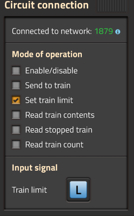
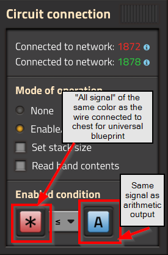
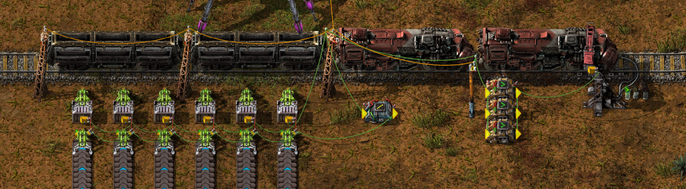

# Factorio Train Philosophy

These are my notes on how to run a good rail network. Very little (probably nothing) written here is original, but I did have to fill in some gaps myself to make it all fit together.

If I say things should or must be a certain way, that's only to fit into *my rail network philosophy*. The great thing about Factorio is that you can build anything you want, and there is no 'best' way to do anything. I do really like this design, as it creates an easily extensible, dynamic network that keeps trains running only when needed, but that might not be the best fit for someone else's base.

I am not an expert in anything factorio, and only have one base where I used rail signals at all! I'm not pretending to have tried or seen everything, just passing on my experience and community knowledge.

I can't credit where I learned everything, but do include credits for the couple of images I copied rather than screenshot.

- **Table of contents**
  
  - [Reasons to use trains](#reasons-to-use-trains)
  - [Trains vs. other transport methods](#trains-vs-other-transport-methods)
  - [Main design principles](#main-design-principles)
  - [Signals](#signals)
  - [Intersections](#intersections)
  - [Stackers](#stackers)
  - [Stations (endpoints)](#stations-endpoints)
  - [Dynamic stations](#dynamic-stations)
  - [Dynamic train schedules](#dynamic-train-schedules)
  - [Advanced (balanced) train loading / unloading](#advanced-balanced-train-loading--unloading)

## Reasons to use trains

1. Throughput of trains is extremely high
    - You can load/unload ***each wagon*** with 12 stack inserters or 24 long inserters in the base game, or 3 pumps per fluid wagon.
    - Trains cover ridiculous distances very easily, with very little requirements for added infrastructure.
    - A cargo wagon has almost the same capacity as a steel chest, and a fluid wagon has the same capacity as a storage tank. Since trains are not limited by distance, you can whip large amounts of resources to far away points. Add more trains to a route for even more throughput.
2. Trains are by FAR the most dynamic logistic system (see comparisons below)
    - If an ore patch is running low / you need more resources, you simply place miners at the new patch and build a new station, and the rest of the infrastructure is already built.
    - Space is essential in the late game, so moving smelters / oil refinery / high use item production to dedicated areas with room for expansion makes a ton a sense. Same as above, build the production site, and add input / output stations and you are done.
3. Trains are the coolest part of Factorio 😎
4. Trains are the only way to get the "Watch your step" achievement?

## Trains vs. other transport methods

1. Trains vs. belts
    - Belts are essential for moving items small distances, and to / from assemblers within a subfactory. Logistic bots also excel in this, if the logistic network is designed correctly.
    - Improving throughput of belts is not easy. As your factory grows, you will find yourself saturating belts. At first you can upgrade the belt to red / blue, but after you hit the 45/sec max of blue belts, you will have to add additional belts to increase throughput. I find a main bus design very effective to get to the first rocket launch, but it's an absolute chore to upgrade, and requires a lot of planning to get belt counts correct from the beginning. Much easier to just add a few more trains to a given route.
    - Belts are not good for transporting long distances, or to / from multiple endpoints. Adding a new ore patch via belt can quickly result in spaghetti, and decommissioning an empty patch is just as much work. If you want to build or relocate a production site, all inputs must be split or rerouted, and dynamically sending resources based on need is much more difficult than with trains.
    - Belts (especially blue belts) are more resource intensive than rails. Stone and iron rods (for rails) are very cheap once you get a couple of patches, and expanding trains to a new area will mostly leverage already-built rails and stations.
2. Trains vs. bots
    - Bots are crazy good at transporting items short distances. The most effective way to do this is to have small, single-purpose logistic networks, rather than a large monolithic network. Inserters / belts or trains can pass items between individual logistic networks.
    - Even moderate distances kill the effectiveness of logistic bots. Some of this can be overcome by strategic placement of roboports for charging, but scaling up throughput over distance is not easy.
    - Since logistic networks should be small, low distance, and non-dynamic by nature, they are a great complement to trains, rather than a replacement for them.
3. Train cons
    - Train stations end up being fairly large. Adding them to already cramped areas can be difficult. As usual, compact is overrated in Factorio, and usually results in non-extendable infrastructure. Plan for large areas (bigger than you think!) and you will be okay.
    - At the early parts of the game, large stations means more surface area to defend. Once you can easily clear nests (for me that is car+grenades) this should not be a big deal. As noted above, I am not a Factorio expert, but I have some tips that made early game defense much easier for me:
      - Don't try to build huge walls and feed machine gun turrets by belt. This greatly limits your growth and is not really scalable. Also, if you follow the advice below the turrets will not need to reload.
      - Aliens WILL NOT attack non-defense (radar is a defense entity) or non-polluting entities unless they get in the way . This means that rails will not be attacked, and power poles / pipes will only be attacked if they get in the way. Use underground pipes for any span greater than two tiles.
      - Build pillboxes of machine gun turrets (I use 3, 6 and 9), and feed ammo by hand when you build them (100 is fine). Aliens will attack these if they are close to their path, so a few defending approaches to the main base and any outposts is all you need (also build pillboxes surrounding exposed radars). If you are clearing nests periodically turrets will not run out of ammo by the time you launch a rocket and can move to laser turrets. Upgrading to piercing ammo is easy, and you can feed the old ammo back into piercing ammo production.
      - If any turrets kill aliens, ***immediately*** drop what you are doing, check your pollution cloud, and wipe out all nests close to the edge of the cloud. This will stop attacks for a while, and greatly reduces defense overhead. Yes, it's a little annoying at first, but this strategy has saved me a ton of headache compared to how I used to play.
      - If aliens get past your pillboxes, they slipped by somewhere without being close enough to aggro to the defenses. Reload a save and watch where they come from, then add pillbox(es) as needed.
      - The first few nests are really the only struggle with this strategy. Automate walls, firearms magazines, and turrets ASAP (it's okay to limit those chests to a sensible amount, but you'll need lots of magazines so go with a few assembly machines right away). If nests are a problem before you get to grenades and the car, it might make sense to just reroll a new map to get you a little more breathing room.

## Main design principles

1. One way tracks everywhere
    - You can either build one way tracks (how we drive on roads - two lanes parallel going in opposite directions), or two way tracks (a single lane handling both directions). One way (two lane) rail is much simpler to expand and signal properly, and just easier to get your head around. The expense of the additional lane is trivial very early.
    - Don't be fooled by the simplicity of setting up a single, two way rail for your first train. As soon as you add a second train or cross paths it gets messy quick.
    - For very early trains, a single lane / single train line with looped endpoints are acceptable for getting to your first additional ore patches, just make sure you are using a single locomotive direction so you do not need to redesign stations. Build the additional lane for one way rails as soon as possible, or once you have rails cross and need signaling. The earlier the better, as redesigning is always harder and longer than going with two lanes initially.
2. Standardize on max train size & locomotive count from beginning
    - This prevents having to redesign intersections & stations later
    - 2 locomotive 2 wagons has worked well for my current base, although designing for 2L/3W or 2L/4W may have resulted in a more flexible network (you can always run smaller than max size trains, but not bigger). In particular, adding flamethrower turrets to artillery/defense stations would have been easier with an additional wagon factored in
3. Standardize on rail spacing and intersections
    - A few blueprints for generic infrastructure is all you should need

## Signals

1. The notes below are just simple summaries of signals. Skip to the bottom of this section for much more complete guides on signaling.
2. Rail signals allow multiple trains to run on the same rail network without crashing into each other. Just preventing crashes is super easy, but making sure trains only stop when necessary (higher throughput) is a little more work.
3. Signaling is a little bit of a head scratcher at first, but once you get it figured out it's simple.
4. Signals divide the rail into 'blocks' (hold a signal in your hand to visualize blocks on a rail)
5. Rail signals prevent a train from entering the next block if another train is already occupying that block, or have reserved that block for travel
6. Chain signals read the current block, and all subsequent blocks on the incoming train's path until the next **rail** signal. These are for intersections - a chain signal at the entrance, chain signals every time a rail crosses another rail, then a rail signal at the exit will ensure a train will only enter an intersection if it can fully exit it (preventing deadlocks). A single rail signal should be used for a single rail crossing (example: right turn in a right-hand-drive network).
7. Rail signals should be placed periodically on long stretches between intersections (creating blocks at least one max train length) - this prevents trains from waiting for trains in front of them, but still prevents faster trains from rear ending slower ones.
8. The official wiki has a great introductory [guide](https://wiki.factorio.com/Tutorial:Train_signals) that should make it easy to digest the basics.
9. This image [guide](https://docs.google.com/presentation/d/1pDj-ccWjUrwG_9_fDzLUosFZx_luGUet5XZwt7uUyzM/pub?slide=id.g12a2bb5fc4_884_132) also comes highly recommended, but doesn't show blocks as much as it should IMO.

## Intersections

1. I only use two intersections for generic infrastructure - a four way intersection, and a T intersection. You could also just build four ways and leave one side empty for a T.
2. Following the signalling rules in the Signalling section above, it can be very easy to design intersections that allow for good throughput. There are excellent blueprints available online, but designing your own is rewarding, ensures that your intersections accommodate your chosen max train length, and if you follow the rules you will have more than adequate throughput.
3. Building your own intersections will also cement proper usage of signals in your head, for when you build non-standard things like forking stations.
4. Since intersections will be blueprinted, you only need to get it right once! It took me a couple of tweaks to get trains to only stop when necessary, but in practice that just meant adding a couple of chain signals where I had missed them.
5. This gif makes explains how to build a four way intersection better than words can. Caption is "Follow each possible route from a single entrance, placing chain signals before every crossing, and a rail signal after the last one", to which I'll add "copy, then rotate three times and paste" (credit: pinned message by "Swan" on the Factorio discord, under the train-help channel)
    - 

## Stackers

1. Stackers are the easiest and most extendable way to have multiple trains visit stations.
2. Stackers can be shared between multiple stations.
3. Here is an image from the wiki Signals guide linked above (credit: Factorio wiki):
    - 
4. Don't just copy this design, but observe the key elements to make a stacker work:
    - Stackers sit between the main rail line and the station
    - Each stacker is a valid path to the station, so trains will pick any of them
    - Each stacker must have a block at least the length one max train!
    - Rail signals at the entrance of each stacker will disable them as they fill up, but leave unused stackers open
    - Chain signals at the exit of the stackers wait until the rail signal at the station opens up, at which point an incoming train is allowed through. This is counter to the 'chain signal in & through / rail signal out golden rule' that a lot of people quote, but looking at it you can see how it works (also, stackers are not really an intersection, where that advice really applies).
5. If designed properly, stackers can be extended as needed. In the example above, there's not much room to add more stackers due to the incoming curve and curve at the first station, but if the stackers were horizontal you could add a bunch more to the north. As usual, give yourself a lot of space to expand unless you know the maximum need of a given station (ore is a good example).

## Stations (endpoints)

1. Every station (pickup and drop) needs stackers. At first this may seem silly, but it allows you to add trains to a given route easily. Rail and signals are cheap, redesigning stations when you've already built yourself into a corner is not. My smallest stations have 2 stackers (3 train capacity - one at station, 2 in stackers), even though they usually only ever service a single train at a time.
2. Every station (pickup and drop) needs to be dynamic (more on that below). This requires decider combinators - go ahead and automate them once you have a rail network.

## Dynamic stations

1. The key for a great rail network is using dynamic stations. This allows you to set up multiple pickup and drop stations at will, and trains will run between all of them without any change to their schedule, and crucially, only as needed.
2. Stations with the same name are all treated the same, and a train with a station name in it's schedule will be able to visit them all.
3. You can click the photo icon when naming a station to use item / entity icons. I use "[item icon] pickup" and "[item icon] drop" for my station names
4. Shift+right click copies entity settings, Shift+left click pastes them. Use this to copy station names, colors, and settings, or locomotive color and schedule. Going from locomotive to station or vice versa copies only the color, which is also helpful.
5. ***ALL dynamic stations should have their train limit set by circuit network***. Doing this correctly will vastly improve throughput, as trains will only run (and clog up intersections) when they are needed. For best results this should be done on both pickup and drop stations.
    - Connect green / red wire to all chests or fluid tanks to obtain a count of the input or output buffer
    - Connect the item / fluid count to the input of a Decider Combinator
    - Set the Decider Combinator to output 1 if there is enough of the item / fluid to fill one train (pickup stations), or empty one train (for drop stations) on the L signal. *the L signal is the default signal that train stations use for 'limit', so it's the easiest choice*
    - Connect the output of the decider combinator to the train station. Click the train station, and on the right you will see the circuit network settings. Check only 'set train limit', it will default to the L signal.
        - 
    - Add combinators up to the maximum the station can handle. Connect their inputs and outputs
        - Set the new combinators to output 1 on L when the item count can accommodate 2,3,4 etc trains
        - Usually the maximum number of trains a station can handle is the number of stackers + 1 (the one at the station). If you have stations sharing stackers, ensure their combined limit does not exceed the number of stations + stackers.
    - 
    - In summary, a count of all items is obtained. If the station has enough items (pickup) or room for items (drop) for a train, a decider combinator outputs 1 on L, which sets the train limit to 1. Since signals on a wire are summed, as the amount of items in the buffer chests changes, each combinator will add a train to the limit up to the max capacity of the station.
    - Factorio 2.0 will be improving decider combinators, so you should be able to do all of this with a single combinator. The principle is the same however.
    - More complex (multi-item) stations require a little bit more logic, but the idea is the same. For example, my artillery / defense stations take a wide variety of items. An array of decider combinators each output a signal if the logistic system storage for each item falls below a given threshold. I could just pipe that into the train limit, but I have 10 items at each station, and only 2 stackers (3 trains can fit). Instead, I feed the output of the initial combinators into a second set: one outputs the input count on L if it is <= 3, and three output 1 on L if the input is greater than 3, ensuring the train limit ***never gets set above the station's train capacity***. (Since a single train type delivers all the items I could probably keep the limit at a single train, but the main idea is to never have more trains path to the station than can fit in it)
6. Dynamic routes should have a 'depot' station, for both refueling and having somewhere to go if all pickups / drops are full.
    - Routes will be discussed more below, but if everything is toggling on / off dynamically, you really don't want to have a train run out of places to go in the middle of the main rail, or at a drop station.
    - I build my depots much like a stacker, but with stations (named "[locomotive icon] depot") on each stacker with a static train limit of 1, room for refuling infrastructure, and no chain signals.
    - This also simplifies refueling, as you only need to get the fuel to the depot(s), rather than trying to refuel at each drop or pickup
    - Likewise, this simplifies upgrading train fuel types. Just drop off the new fuel at the depot and trains will fill up with that once they burn off the old stuff.
    - I put a fuel drop station as the top slot of my depots, with a dedicated route. Bots or belts can then pass fuel to all the "[locomotive icon] depot" stations

## Dynamic train schedules

1. It took me a good while to get this right, and none of the guides I read really discussed how to make sure dynamic trains weren't just running 24/7.
2. Factorio 2.0 will be adding train schedule interrupts, so some of this will become more flexible, but in ways that should be easy to understand. I think depots will still be essential to prevent stopping on tracks.
3. Do NOT enable / disable stations via circuit network
    - There may be some times where this is okay, but really, just add a decider combinator and set the train limit to 1 or zero instead.
    - This is one of the keys to keeping trains running only when needed. The way it works is simple: trains will **skip** stations on their schedule if they are disabled (bad, likely just going back and forth between pickup and depot), *but will wait for them to open up* if their train limit is full or at zero (good, keeps traffic and fuel use to minimum needed).
4. Basic schedule is dead easy - head to item pickup until full, head to drop until empty, head to depot until some inactivity (fully fueled)
    - This simple configuration works well only because of the set up discussed in the Dynamic Stations section.
    - Since stations will not set their train limit above the maximum number they can fit, there will be enough stackers for each train dispatched there, so no chance of deadlocks or blocking main rail.
    - This is the key: *If no stations of a given name require a train, trains will wait at their current station*. Once I got this right my train traffic plummeted to a mere fraction of what it was before, as trains are only running as the stations require. This keeps intersections clear, improving throughput and reducing fuel usage.
    - Since stations only request the number of trains they can accommodate, load and unload times should be basically maximum for a given design, so setting timeout conditions are not really necessary. More advanced control of loading and unloading (discussed at the end of this document) can further ensure that cargo is processed at the maximum rate, so the full / empty conditions are completely sufficient.
    - In practice, you generally will have more pickup stations than drop stations. The result is that a train goes to the pickup, fills up, then sees that no drop station is available. It waits at the pickup station until a drop requires more items. If the pickup station has enough items for more trains, the trains will queue at the stacker up to the maximum the station can handle. This is great, because they are right there to fill up, and are not clogging depots.
    - If you run into a situation where no pickups are full enough for a train, trains will wait at the depot until one is available
    - A large number of depot stations is still advisable, because if the above situation (no pickups available) occurs *and* all the depots are full, empty trains will just sit at the drop stations, which is very bad. 1 depot station per dynamic train would be a way to prevent this in 100% of situations, but is probably overkill. Add a couple of big depots in an unused area if you want extra protection.
5. Fuel delivery schedule is also easy
    - As I mentioned, the top slot of my depots is a fuel drop station.
    - A route picks up at the fuel pickup until full, then heads to fuel drop station until inactivity (depot has full fuel or train is empty).
    - The fuel delivery trains are fueled at the fuel drop.
    - Fuel drop stations have their train limit set to one after fuel storage at the depot drops below a certain threshold, ensuring that fuel trains only run when a depot needs fuel
    - Stackers at fuel pickup should be able to accommodate all fuel trains, so there is no need for a depot stop on the schedule, or to dynamically disable / enable fuel pickup (they will just sit at the pickup station / stacker until needed). I'm only using a single fuel delivery train for nuclear fuel right now, but have a few stackers if that needs to change. Since fuel usage is low (due to dynamic stations), a single fuel delivery train is working very well for my network, but obviously a megabase would have different needs.

## Advanced (balanced) train loading / unloading

1. If you followed the advice above, trains will only head to stations that have enough items or room to load or unload the train's capacity
2. However, there are lots of times where the simple schedule discussed (pickup until full, drop until empty, depot until some inactivity) results in bad outcomes, even though the station will only request a train if it has enough items / room
    - Inserters that feed entities prefer the outside lane of a belt, so output buffer chests will usually be pulled from unevenly
    - Belt balancers are hard to get 100% perfect. I commonly find inputs or outputs flowing unevenly. This can result in entire lanes of input / output being depleted while other lanes / buffers are full.
    - Depending on how your inputs / outputs are designed, you may find whole wagons, or sides of a loader / unloader station empty while the other wagon / side is full. This can be particularly bad for throughput if one wagon is empty while a mostly full wagon sits there topping off full chests at an unloading station
3. The simplest solution I've seen to this problem is to balance loading / unloading between inserters at a station
    - First of all, it is worth mentioning that balancing inserters will usually result in a slight decrease from the maximum throughput *at the train station*, since not all inserters will be running all the time. However, outputs or inputs will be evenly utilized, and trains will spend a consistent time at stations (more trains over time = more throughput). The biggest throughput killer is having empty chests!
    - Balancing is less important if trains are not ever filling up the input / output buffer, so might not be as useful in the early stages of your rail network, but is extremely useful as production improves
    - Balancing inserters allows whatever belt balancer you are using for input / output to back up and compensate the belts that need more items
    - Balancing inserters is a pretty simple concept, using the circuit network:
        - Obtain a count of the input / output chests (should already have that in order to set train limits)
        - Use an arithmetic combinator to obtain the average count of the chests (divide total by number of chests). For a universal blueprint, you can average the * signal (the 'all signals' signal). I use the A signal for output, but that is a default signal for accumulator charge, you can use something else if you like.
            - 
        - Connect the output of the arithmeic combinator (average count) to inserters
        - Connect inserters to their respective chests so they know how full their chests are
        - Only enable inserters if their chest is less or equal to the average. Use the * signal of the same color wire connecting the chest to inserter for a universal blueprint
            - 
        - This results in several circuit networks for the balancer:
            - One for the total count (connected to all chests and arithmetic combinator input, as well as the train limit decider combinators)
            - One for the average (connected to arithmetic combinator output and all inserters going to chests)
            - Individual connections from each inserter dropping in a chest to that chest
        - Since there are only 2 circuit wire colors, the wires going to / from the arithmetic combinator must be the same color (green in examples below), and the ones connecting chests to inserters must be the other color (red in examples below)
        - Loading example, single side and 3 inserters / wagon to make it easier to see wires (includes deciders for train limit), note the red wires connecting chests to inserters:
            - 
        - Unloading example, single side and 3 inserters / wagon to make it easier to see wires (includes deciders for train limit), note the red wires connecting chests to inserters:
            - 
    - Only inserters going TO a buffer chest should be balanced
        - If **loading** a train, these are the inserters going from the input belts to the buffer chests, not the inserters loading the train
        - If **unloading** a train, these are the inserters pulling from the train to the buffer chests, not the inserters placing onto output
    - This principle can also be used for fluid by separating the buffer tanks. Fluids, um, flow together so I have found less of a problem there
